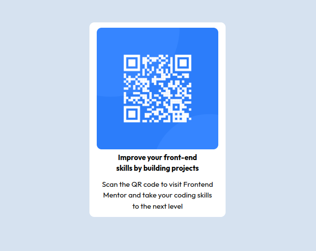

# Frontend Mentor - QR code component solution

This is a solution to the [QR code component challenge on Frontend Mentor](https://www.frontendmentor.io/challenges/qr-code-component-iux_sIO_H). Frontend Mentor challenges help you improve your coding skills by building realistic projects. 


## Overview

### Screenshot



### Links

- Solution URL: [Add solution URL here](https://your-solution-url.com)
- Live Site URL: [Add live site URL here](https://your-live-site-url.com)

## Meu processo

### Linguagens

- HTML5
- CSS3

### O que eu aprendi

Esse projeto, me ajudou a relembra a base do HTML e CSS, e como é importante manter o código semântico e fácil de se ler.

To see how you can add code snippets, see below:

```html
<main>
  <div class="card">
    <figure>
      
    </figure>
    <div class="card__text">
      <h1>
        Improve your front-end<br>skills by building projects
      </h1>
      <p>
        Scan the QR code to visit Frontend Mentor and take your coding skills to the next level
      </p>
    </div>
  </div>
</main>
```
